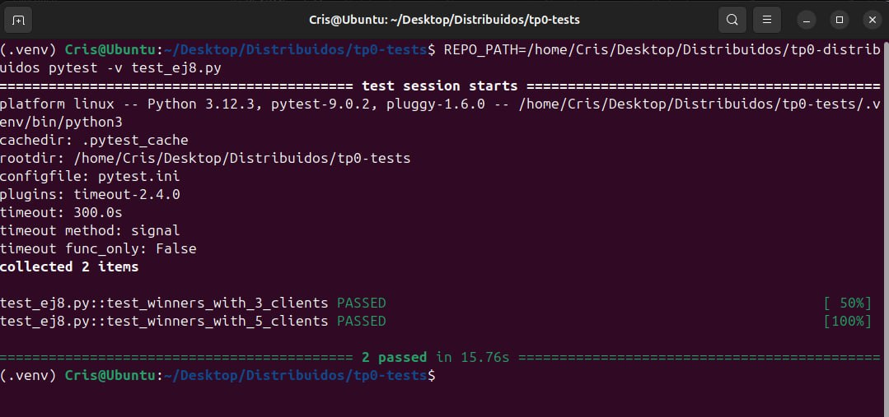

TP0: Docker + Comunicaciones + Concurrencia

Cristian Martin Lin - 107825

## Parte 1: Introducción a Docker

### Ejercicio N°1:
Se implementó el script `generar-compose.sh` en la raíz del proyecto para generar un archivo Docker Compose con una cantidad configurable de clientes.

**Ejecución:**
```bash
./generar-compose.sh <arhcivo_salida> N

# Ejemplo
./generar-compose.sh docker-compose-dev.yaml 5
```

Luego, se puede levantar el entorno con:
```bash
make docker-compose-up
```

### Ejercicio N°2:
Para evitar tener que reconstruir las imágenes al modificar la configuración, se inyectaron los archivos de config como volúmenes dentro de los containers:

- Servidor: se monta `./server/config.ini` en `/config.ini`
- Cliente(s): se monta `./client/config.yaml` en `/config.yaml`

De esta forma, cualquier cambio en los archivos `config.ini` / `config.yaml` impacta directamente al ejecutar el contenedor, ya que los archivos quedan persistidos por fuera de la imagen. Se levanta de la misma manera que el ejercicio 1.

### Ejercicio N°3:
Se implementó el script `validar-echo-server.sh` para verificar el correcto funcionamiento del servidor (echo server) usando `netcat`, sin instalarlo en la máquina host y sin exponer puertos.

**Detalle de la solución:**
- El script primero verifica que el container `server` esté corriendo.
- Obtiene dinámicamente la red Docker a la que está conectado el servidor (vía `docker inspect`).
- Genera un mensaje único con timestamp.
- Levanta un contenedor efímero `alpine` conectado a esa misma red, instala `netcat` dentro del contenedor y envía el mensaje al servidor.
- Si la respuesta coincide exactamente con el mensaje enviado imprime:
  - `action: test_echo_server | result: success`
  - en caso contrario: `action: test_echo_server | result: fail`


**Ejecución:**
1. Levantar el entorno:
```bash
./generar-compose.sh docker-compose-dev.yaml N

make docker-compose-up
```

2. Ejecutar el validador:
```bash
./validar-echo-server.sh
```

### Ejercicio N°4:
Se agregó manejo de la señal SIGTERM tanto en servidor como en cliente para lograr un cierre graceful, liberando correctamente los recursos (sockets) antes de terminar el proceso.

- **Cliente (Go):** al recibir SIGTERM se cancela la ejecución, se corta el loop y se cierra el socket.
- **Servidor (Python):** al recibir SIGTERM se llama a `server.stop()` para cerrar el socket de escucha y terminar el loop de `accept()`.

**Cómo probar el shutdown graceful:**
Con el entorno levantado, puede enviarse SIGTERM usando:
```bash
docker compose -f docker-compose-dev.yaml stop -t <segundos>
```

## Parte 2: Repaso de Comunicaciones

### Ejercicio N°5:
Se modificó el cliente y el servidor para enviar y almacenar apuestas.

- **Cliente (Go):** toma la apuesta desde variables de entorno (`NOMBRE`, `APELLIDO`, `DOCUMENTO`, `NACIMIENTO`, `NUMERO` + `CLI_ID` como id de agencia), la envía al servidor y espera un ACK. Si el ACK indica éxito loguea:  
  `action: apuesta_enviada | result: success | dni: ${DNI} | numero: ${NUMERO}`

- **Servidor (Python):** recibe la apuesta, la almacena usando `store_bets(...)` (provista por la cátedra) y responde con ACK. Si persiste correctamente loguea:  
  `action: apuesta_almacenada | result: success | dni: ${DNI} | numero: ${NUMERO}`

**Protocolo / Comunicación:**
- Se implementó un framing: `u32` big-endian con el largo del payload + `payload`.
- `payload`:
  - `msg_type` (1 byte)
  - campos en orden fijo (strings con largo `u16` + bytes UTF-8, y `number` como `u32` BE)
- La respuesta del servidor es un ACK (`msg_type` + status OK/ERROR).  
Esto evita *short read/write* leyendo/escribiendo exactamente la cantidad de bytes indicada.

### Ejercicio N°6:
Los clientes envían apuestas en batches. Cada cliente lee sus apuestas desde `.data/agency-{N}.csv`, inyectado al contenedor por volumen, y las envía al servidor en chunks de tamaño configurable por `batch.maxAmount` en `client/config.yaml` (limitando el tamaño de los paquetes).

- **Cliente:** lee el CSV, lo divide en batches y envía un mensaje por batch.
- **Servidor:** procesa todas las apuestas del batch; si todas se persisten con `store_bets(...)` responde OK y loguea  
  `action: apuesta_recibida | result: success | cantidad: ${CANTIDAD}`  
  si falla alguna, responde ERROR y loguea el mismo `action` con `result: fail`.

**Protocolo:**
Se mantiene el framing del Ej. 5 (`u32` BE + payload) y se agrega `MSG_BATCH`, que incluye `cantidad (u16)` + apuestas en orden fijo.

### Ejercicio N°7:
Al finalizar el envío de apuestas, cada cliente notifica al servidor con `FIN` y luego consulta los ganadores de su agencia.

- **Cliente:** envía `MSG_FIN` (incluye `agency`) y luego consulta con `MSG_GET_WINNERS`. Al recibir la respuesta imprime:  
  `action: consulta_ganadores | result: success | cant_ganadores: ${CANT}`

- **Servidor:** acumula las notificaciones `FIN` de las agencias. Cuando recibe `FIN` de todas las agencias participantes realiza el sorteo (usando `load_bets(...)` + `has_won(...)`) e imprime:  
  `action: sorteo | result: success`  
  Luego responde a cada consulta sólo con los DNIs ganadores de esa agencia (sin broadcast).

**Protocolo:**
Se mantiene el framing (`u32` BE + payload) y se agregan:
- `MSG_FIN` (cliente → servidor): fin de envío de una agencia.
- `MSG_GET_WINNERS` (cliente → servidor): consulta ganadores de una agencia.
- `MSG_WINNERS` (servidor → cliente): lista de DNIs ganadores filtrada por agencia.

## Parte 3: Repaso de Concurrencia

### Ejercicio N°8:
Se modificó el servidor para aceptar conexiones y procesar mensajes en paralelo usando *multithreading* (1 thread por conexión).

- En el `accept()` el servidor crea un `threading.Thread` por cliente para atenderlo sin bloquear al resto.
- Para evitar condiciones de carrera se usan locks:
  - un lock de estado para coordinar `FIN`, sorteo y consultas pendientes (`_state_lock`)
  - un lock de storage para serializar `store_bets(...)` / `load_bets(...)` cuando hay varios threads

**Resultado de tests provista por la cátedra:**


## Condiciones de Entrega
Se espera que los alumnos realicen un _fork_ del presente repositorio para el desarrollo de los ejercicios y que aprovechen el esqueleto provisto tanto (o tan poco) como consideren necesario.

Cada ejercicio deberá resolverse en una rama independiente con nombres siguiendo el formato `ej${Nro de ejercicio}`. Se permite agregar commits en cualquier órden, así como crear una rama a partir de otra, pero al momento de la entrega deberán existir 8 ramas llamadas: ej1, ej2, ..., ej7, ej8.
 (hint: verificar listado de ramas y últimos commits con `git ls-remote`)

Se espera que se redacte una sección del README en donde se indique cómo ejecutar cada ejercicio y se detallen los aspectos más importantes de la solución provista, como ser el protocolo de comunicación implementado (Parte 2) y los mecanismos de sincronización utilizados (Parte 3).

Se proveen [pruebas automáticas](https://github.com/7574-sistemas-distribuidos/tp0-tests) de caja negra. Se exige que la resolución de los ejercicios pase tales pruebas, o en su defecto que las discrepancias sean justificadas y discutidas con los docentes antes del día de la entrega. 

El incumplimiento de las pruebas es condición de desaprobación, pero su cumplimiento no es suficiente para la aprobación.  Se pide a los alumnos leer atentamente y **tener en cuenta** los criterios de corrección informados  [en el campus](https://campusgrado.fi.uba.ar/mod/page/view.php?id=73393).
Respetar el formato y contenido las entradas de logs descritas en los ejercicios, pues son las que se chequean en cada uno de los tests.
