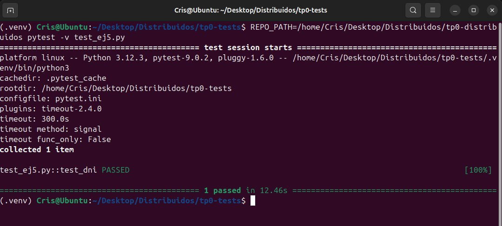

# TP0: Docker + Comunicaciones + Concurrencia

Cristian Martin Lin - 107825

## Parte 1: Introducción a Docker

### Ejercicio N°1:
Se implementó el script `generar-compose.sh` en la raíz del proyecto para generar un archivo Docker Compose con una cantidad configurable de clientes.

**Ejecución:**
```bash
./generar-compose.sh <arhcivo_salida> N

# Ejemplo
./generar-compose.sh docker-compose-dev.yaml 5
```

Luego, se puede levantar el entorno con:
```bash
make docker-compose-up
```

### Ejercicio N°2:
Para evitar tener que reconstruir las imágenes al modificar la configuración, se inyectaron los archivos de config como volúmenes dentro de los containers:

- Servidor: se monta `./server/config.ini` en `/config.ini`
- Cliente(s): se monta `./client/config.yaml` en `/config.yaml`

De esta forma, cualquier cambio en los archivos `config.ini` / `config.yaml` impacta directamente al ejecutar el contenedor, ya que los archivos quedan persistidos por fuera de la imagen. Se levanta de la misma manera que el ejercicio 1.

### Ejercicio N°3:
Se implementó el script `validar-echo-server.sh` para verificar el correcto funcionamiento del servidor (echo server) usando `netcat`, sin instalarlo en la máquina host y sin exponer puertos.

**Detalle de la solución:**
- El script primero verifica que el container `server` esté corriendo.
- Obtiene dinámicamente la red Docker a la que está conectado el servidor (vía `docker inspect`).
- Genera un mensaje único con timestamp.
- Levanta un contenedor efímero `alpine` conectado a esa misma red, instala `netcat` dentro del contenedor y envía el mensaje al servidor.
- Si la respuesta coincide exactamente con el mensaje enviado imprime:
  - `action: test_echo_server | result: success`
  - en caso contrario: `action: test_echo_server | result: fail`


**Ejecución:**
1. Levantar el entorno:
```bash
./generar-compose.sh docker-compose-dev.yaml N

make docker-compose-up
```

2. Ejecutar el validador:
```bash
./validar-echo-server.sh
```

### Ejercicio N°4:
Se agregó manejo de la señal SIGTERM tanto en servidor como en cliente para lograr un cierre graceful, liberando correctamente los recursos (sockets) antes de terminar el proceso.

- **Cliente (Go):** al recibir SIGTERM se cancela la ejecución, se corta el loop y se cierra el socket.
- **Servidor (Python):** al recibir SIGTERM se llama a `server.stop()` para cerrar el socket de escucha y terminar el loop de `accept()`.

**Cómo probar el shutdown graceful:**
Con el entorno levantado, puede enviarse SIGTERM usando:
```bash
docker compose -f docker-compose-dev.yaml stop -t <segundos>
```

## Parte 2: Repaso de Comunicaciones

### Ejercicio N°5:
Se modificó el cliente y el servidor para enviar y almacenar apuestas.

- **Cliente (Go):** toma la apuesta desde variables de entorno (`NOMBRE`, `APELLIDO`, `DOCUMENTO`, `NACIMIENTO`, `NUMERO` + `CLI_ID` como id de agencia), la envía al servidor y espera un ACK. Si el ACK indica éxito loguea:  
  `action: apuesta_enviada | result: success | dni: ${DNI} | numero: ${NUMERO}`

- **Servidor (Python):** recibe la apuesta, la almacena usando `store_bets(...)` (provista por la cátedra) y responde con ACK. Si persiste correctamente loguea:  
  `action: apuesta_almacenada | result: success | dni: ${DNI} | numero: ${NUMERO}`

**Protocolo / Comunicación:**
- Se implementó un framing: `u32` big-endian con el largo del payload + `payload`.
- `payload`:
  - `msg_type` (1 byte)
  - campos en orden fijo (strings con largo `u16` + bytes UTF-8, y `number` como `u32` BE)
- La respuesta del servidor es un ACK (`msg_type` + status OK/ERROR).  
Esto evita *short read/write* leyendo/escribiendo exactamente la cantidad de bytes indicada.

**Resultado de tests provista por la cátedra:**
`

### Ejercicio N°6:
Modificar los clientes para que envíen varias apuestas a la vez (modalidad conocida como procesamiento por _chunks_ o _batchs_). 
Los _batchs_ permiten que el cliente registre varias apuestas en una misma consulta, acortando tiempos de transmisión y procesamiento.

La información de cada agencia será simulada por la ingesta de su archivo numerado correspondiente, provisto por la cátedra dentro de `.data/datasets.zip`.
Los archivos deberán ser inyectados en los containers correspondientes y persistido por fuera de la imagen (hint: `docker volumes`), manteniendo la convencion de que el cliente N utilizara el archivo de apuestas `.data/agency-{N}.csv` .

En el servidor, si todas las apuestas del *batch* fueron procesadas correctamente, imprimir por log: `action: apuesta_recibida | result: success | cantidad: ${CANTIDAD_DE_APUESTAS}`. En caso de detectar un error con alguna de las apuestas, debe responder con un código de error a elección e imprimir: `action: apuesta_recibida | result: fail | cantidad: ${CANTIDAD_DE_APUESTAS}`.

La cantidad máxima de apuestas dentro de cada _batch_ debe ser configurable desde config.yaml. Respetar la clave `batch: maxAmount`, pero modificar el valor por defecto de modo tal que los paquetes no excedan los 8kB. 

Por su parte, el servidor deberá responder con éxito solamente si todas las apuestas del _batch_ fueron procesadas correctamente.

### Ejercicio N°7:

Modificar los clientes para que notifiquen al servidor al finalizar con el envío de todas las apuestas y así proceder con el sorteo.
Inmediatamente después de la notificacion, los clientes consultarán la lista de ganadores del sorteo correspondientes a su agencia.
Una vez el cliente obtenga los resultados, deberá imprimir por log: `action: consulta_ganadores | result: success | cant_ganadores: ${CANT}`.

El servidor deberá esperar la notificación de las 5 agencias para considerar que se realizó el sorteo e imprimir por log: `action: sorteo | result: success`.
Luego de este evento, podrá verificar cada apuesta con las funciones `load_bets(...)` y `has_won(...)` y retornar los DNI de los ganadores de la agencia en cuestión. Antes del sorteo no se podrán responder consultas por la lista de ganadores con información parcial.

Las funciones `load_bets(...)` y `has_won(...)` son provistas por la cátedra y no podrán ser modificadas por el alumno.

No es correcto realizar un broadcast de todos los ganadores hacia todas las agencias, se espera que se informen los DNIs ganadores que correspondan a cada una de ellas.

## Parte 3: Repaso de Concurrencia
En este ejercicio es importante considerar los mecanismos de sincronización a utilizar para el correcto funcionamiento de la persistencia.

### Ejercicio N°8:

Modificar el servidor para que permita aceptar conexiones y procesar mensajes en paralelo. En caso de que el alumno implemente el servidor en Python utilizando _multithreading_,  deberán tenerse en cuenta las [limitaciones propias del lenguaje](https://wiki.python.org/moin/GlobalInterpreterLock).

## Condiciones de Entrega
Se espera que los alumnos realicen un _fork_ del presente repositorio para el desarrollo de los ejercicios y que aprovechen el esqueleto provisto tanto (o tan poco) como consideren necesario.

Cada ejercicio deberá resolverse en una rama independiente con nombres siguiendo el formato `ej${Nro de ejercicio}`. Se permite agregar commits en cualquier órden, así como crear una rama a partir de otra, pero al momento de la entrega deberán existir 8 ramas llamadas: ej1, ej2, ..., ej7, ej8.
 (hint: verificar listado de ramas y últimos commits con `git ls-remote`)

Se espera que se redacte una sección del README en donde se indique cómo ejecutar cada ejercicio y se detallen los aspectos más importantes de la solución provista, como ser el protocolo de comunicación implementado (Parte 2) y los mecanismos de sincronización utilizados (Parte 3).

Se proveen [pruebas automáticas](https://github.com/7574-sistemas-distribuidos/tp0-tests) de caja negra. Se exige que la resolución de los ejercicios pase tales pruebas, o en su defecto que las discrepancias sean justificadas y discutidas con los docentes antes del día de la entrega. 

El incumplimiento de las pruebas es condición de desaprobación, pero su cumplimiento no es suficiente para la aprobación.  Se pide a los alumnos leer atentamente y **tener en cuenta** los criterios de corrección informados  [en el campus](https://campusgrado.fi.uba.ar/mod/page/view.php?id=73393).
Respetar el formato y contenido las entradas de logs descritas en los ejercicios, pues son las que se chequean en cada uno de los tests.
